### Serverbeheer : installation Windows Server 2019 Core

# 1. VMWare

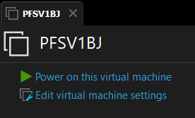


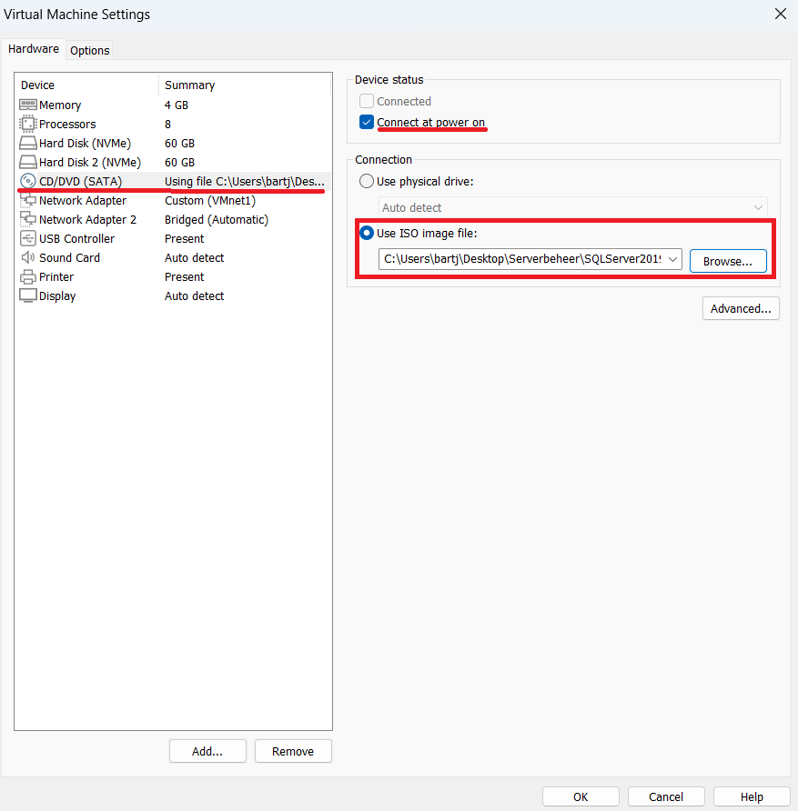

> 1. Kies CD/DVD (sata)
> 2. Vink "Connect at power on" aan.
> 3. "Use ISO image file:" *browse naar uw ISO file*
> 4. Start de VM Machine

# 2. De installatie

## 2.1 Info
Bekijk de IP adress op digitap 

```
    voornaam : bart
    naam: janssens
    email: bart.janssens02@student.ap.be
    initialen: BJ
    ip adres   YYY.YYY.YYY : 192.168.78
    ip adres   ZZZ.ZZZ.ZZZ : 172.16.78
```

**Paswoorden** zelf te kiezen maar zelf ook bij te houden. 
> example : **ApAdmin2022**

## 2.2 Huidige Topologie

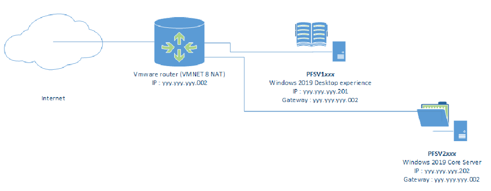

## 2.3 De installatie

*power on your VM Machine*


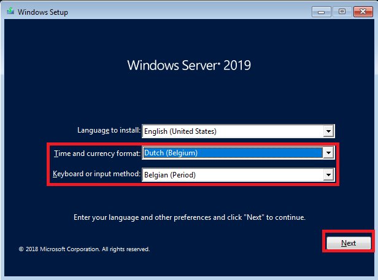
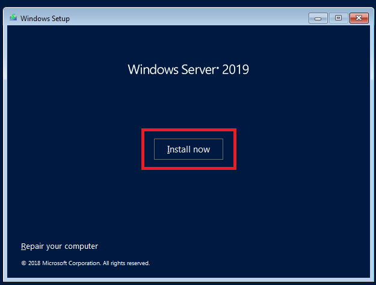
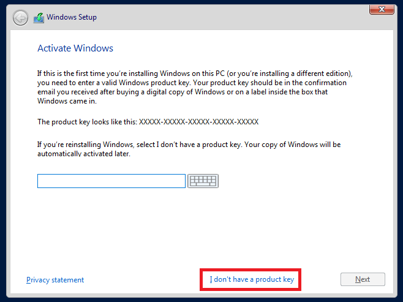
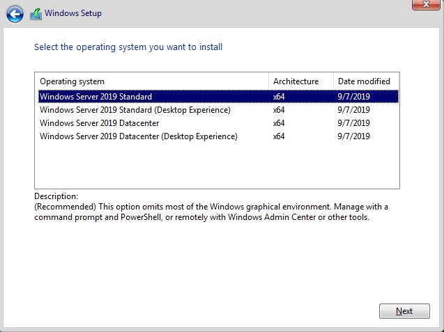
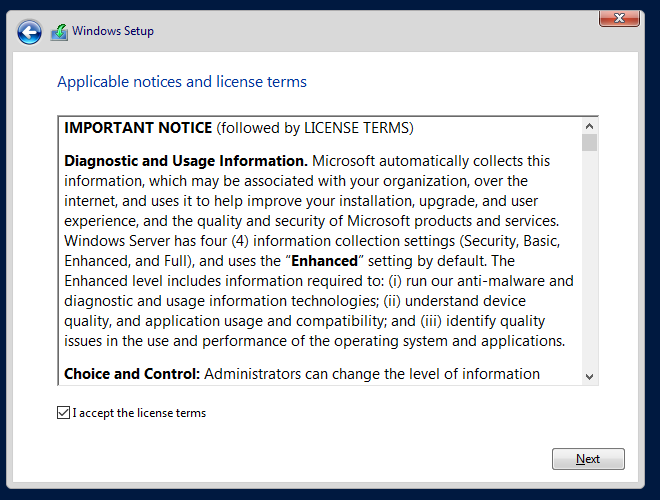
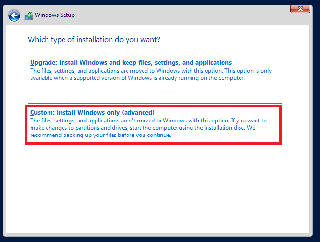
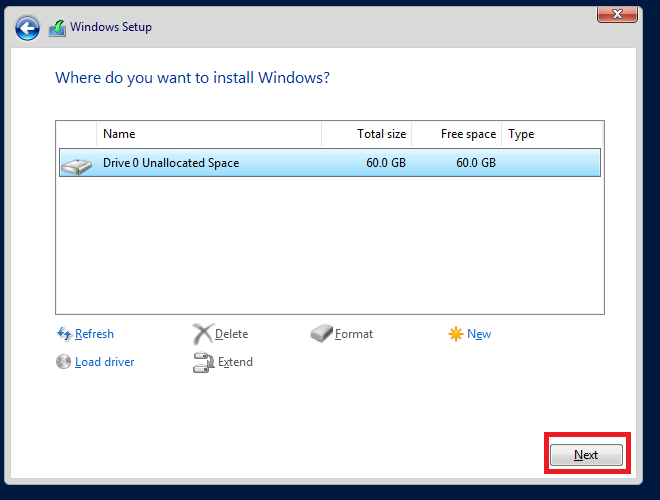
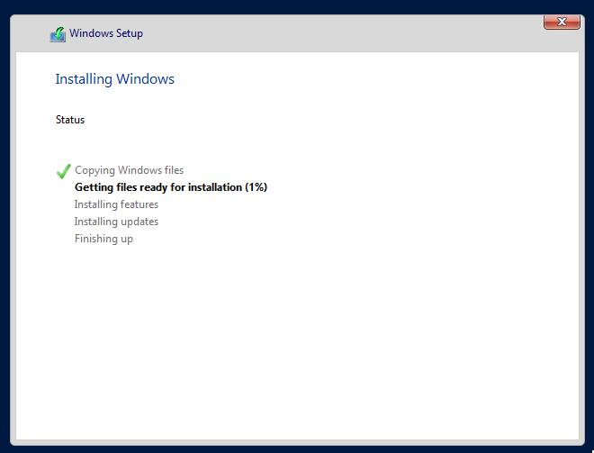