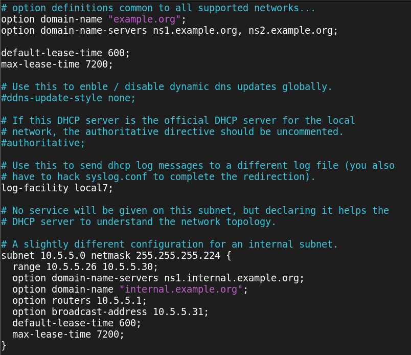

> **Note**
> Deze tutorial is gebasseerd op de video op Digitap
> [Link to video](https://learning.ap.be/pluginfile.php/1901464/mod_resource/content/1/installatie%20DHCP%20.MP4)


# DCHP op Linux

1. DCHP feature installeren 

```bash
yum install dhcp-server
```

> **Note**
> Als dhcp reed geïnstalleerd is krijg je de melding
> *Package dhcp-server ... is allready installed*
> *Nothing to do*
> *Complete!*

2. DHCP configuratie

```bash
sudo vi /etc/dhcp/dhcpd.conf
```


> **Note**
> We gebruiken het **dhcpd.conf.example** als template
> je zal gevraagd worden of het origineel mag overschreven worden -> yes

```bash
sudo cp /usr/share/doc/dhcp-server/dhcpd.conf.example /etc/dhcp/dhcpd.conf
```

```bash
sudo vi /etc/dhcp/dhcpd.conf
```

## Cleaning up the config file
### handige VI commands

*Multi row delete*
> V , select with arrow keys , D

| **Command** | **Action**  |
|-------------|-------------|
| V           | Visual Mode |
| D           | Delete      |

*Undo,Redo*
| **Command** | **Action**  |
|-------------|-------------|
| V           | Visual Mode |
| Y           | Undo        |
| CTRL+r      | Delete      |

*EINDRESULAAT*



```bash
# option definitions common to all supported networks...
option domain-name "_______delekkere.be_______";
option domain-name-servers [SERVER].delekkere.be;

default-lease-time [600]; # moeten INT zijn!
max-lease-time [7200];    # moeten INT zijn!

# Use this to enble / disable dynamic dns updates globally.
ddns-update-style [standard]; # zet DDNS op standaard, toelaten dat er een DDNS update 
gebeurd

# If this DHCP server is the official DHCP server for the local
# network, the authoritative directive should be uncommented.
authoritative; # authoratief voor zone "delekkere.be"

# Use this to send dhcp log messages to a different log file (you also
# have to hack syslog.conf to complete the redirection).
log-facility local7;

# No service will be given on this subnet, but declaring it helps the 
# DHCP server to understand the network topology.

# Configuration for DLLSV1.
subnet [172.16.78.0] netmask [255.255.255.0] {
  range [172.16.78.10 172.16.78.30;]                # range waar IP's worden uitgedeeld VAN TOT
  option domain-name-servers [SERVER.delekkere.be;] # specifieer voor welk DNS gebied, mag ook het IP adres zijn.
  option routers [172.16.78.1;]                     # gate-way
  default-lease-time [600;]                         # moeten INT zijn!
  max-lease-time [7200;]                            # moeten INT zijn!
}
```

3. De linux server als router instellen zodat de werkstations op internet kunnen

## Routing forwarding instellen:

Na invoer moet dit zichtbaar zijn op de PFSV1 (zie foto)

Commando:
```bash
sysctl -w net.ipv4.ip_forward=1
```
## START DHCP

```bash
systemctl status dhcpd
```

```bash
systemctl start dhcpd
```

## TROUBLESHOOTING

```bash
systemctl status dhcpd.service
```

```bash
dhcpd -t -cf /etc/dhcp/dhcpd.conf
```


> **Note**
> De firewall dient (voorlopig) uit te staan om dit werkende te krijgen
> *check digitap voor de commandos ter controle.*
> of check het firewall.md document :
> [firewall.md](firewall.md)


