### Serverbeheer : installation Windows Server 2019 met GUI

# 1. VMWare

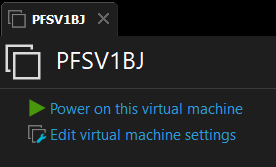


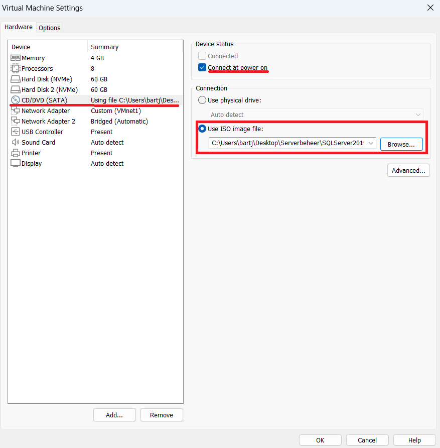

> 1. Kies CD/DVD (sata)
> 2. Vink "Connect at power on" aan.
> 3. "Use ISO image file:" *browse naar uw ISO file*
> 4. Start de VM Machine

# 2. De installatie

## 2.1 Info
Bekijk de IP adress op digitap of in dit repo onder ```files```

```
    voornaam : bart
    naam: janssens
    email: bart.janssens02@student.ap.be
    initialen: BJ
    ip adres   YYY.YYY.YYY : 192.168.78
    ip adres   ZZZ.ZZZ.ZZZ : 172.16.78
```

**Paswoorden** zelf te kiezen maar zelf ook bij te houden. 
> example : **ApAdmin2022**

## 2.2 De installatie

*power on your VM Machine*


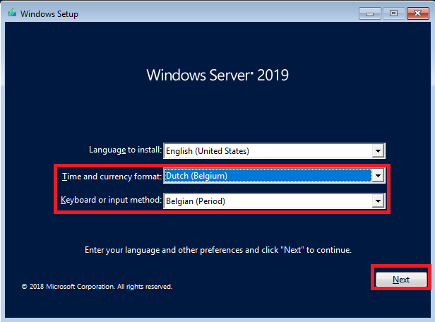
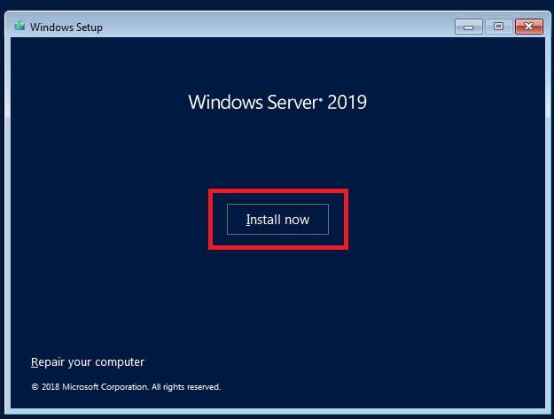
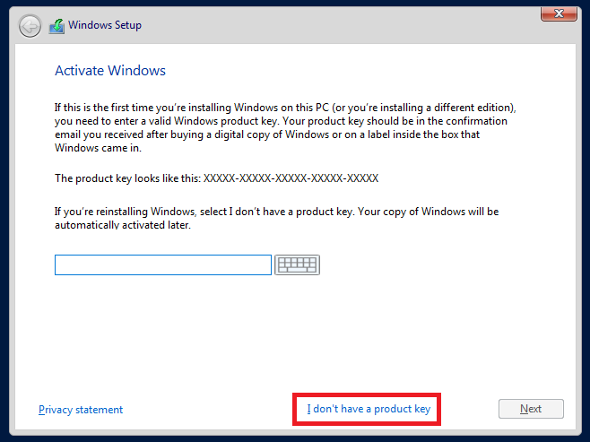
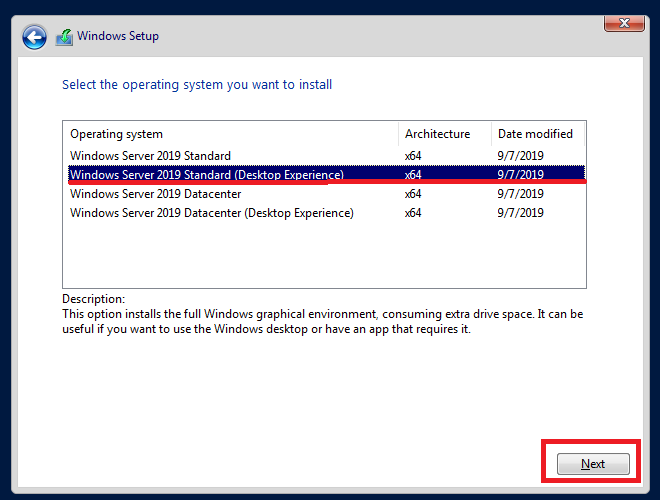
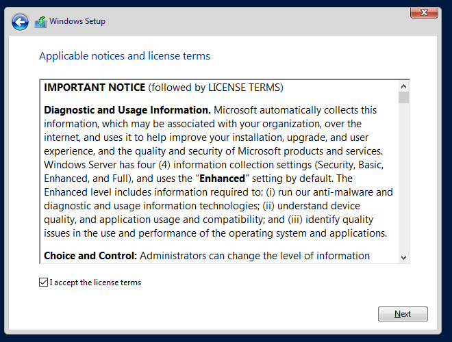
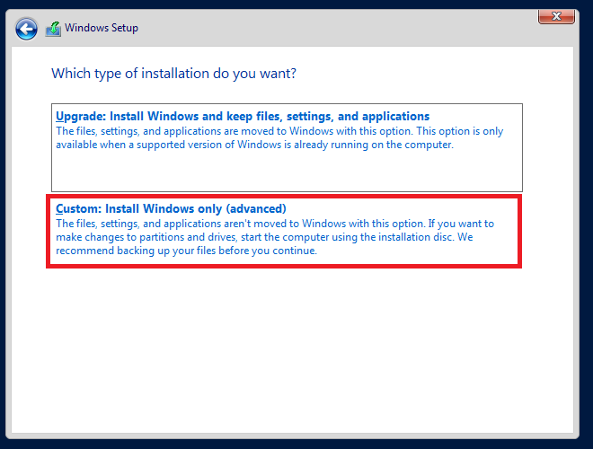
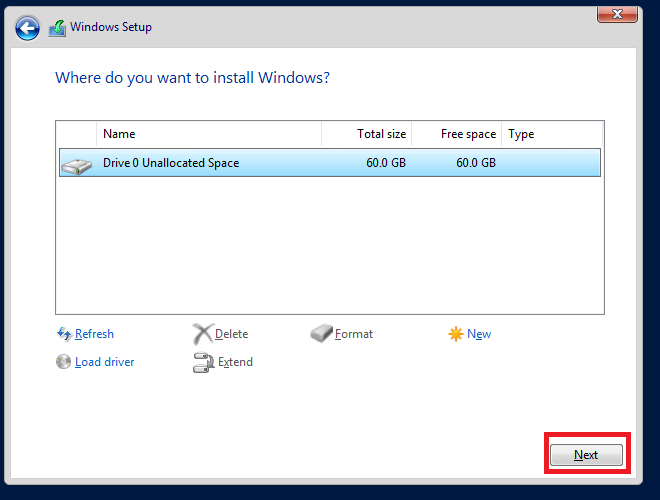
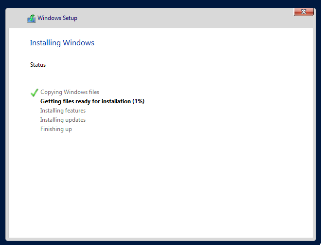

> als deze stap klaar is zal de machine automatisch rebooten 

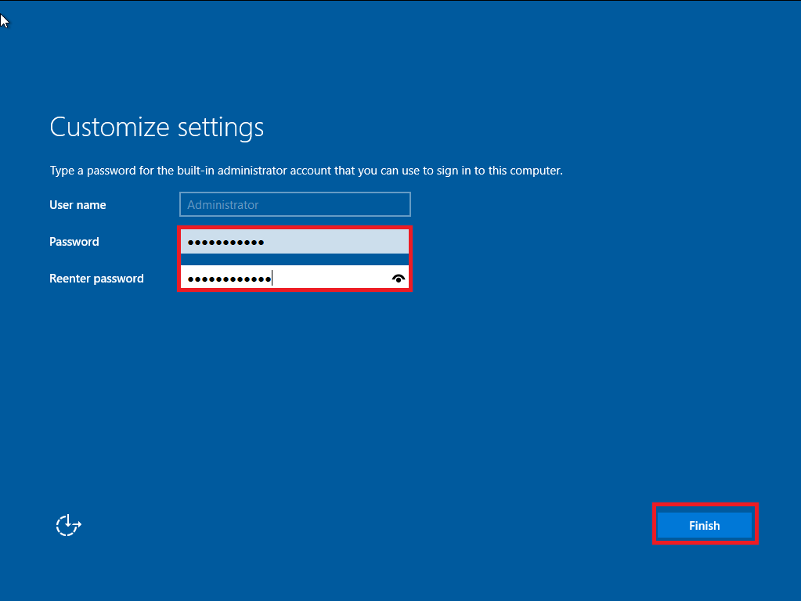    


> 
>
> What are the Windows Server 2019 default password requirements?
>
> **Local accounts:**
> - Password must not contain the user's account name or more than two consecutive characters from the - user's full name.
> - Password must be six or more characters long.
> - Password must contain characters from three of the following four categories: Uppercase characters - A-Z (Latin alphabet)

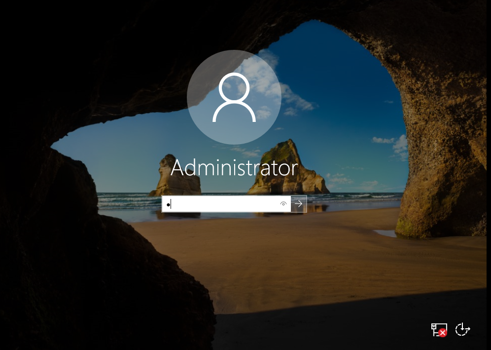

